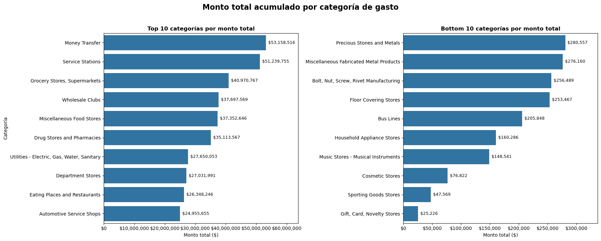
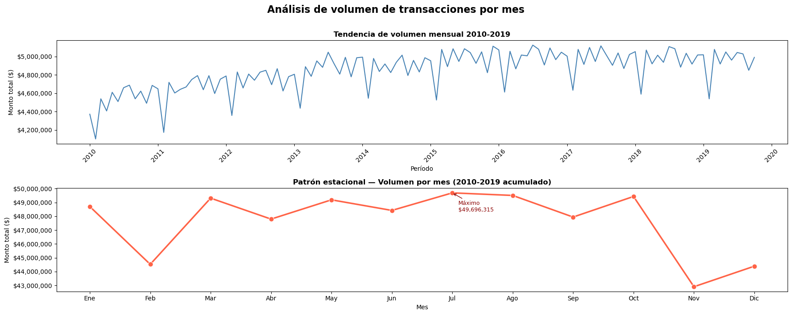
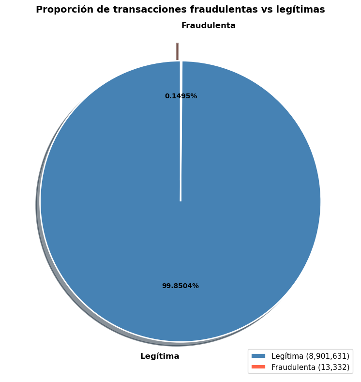
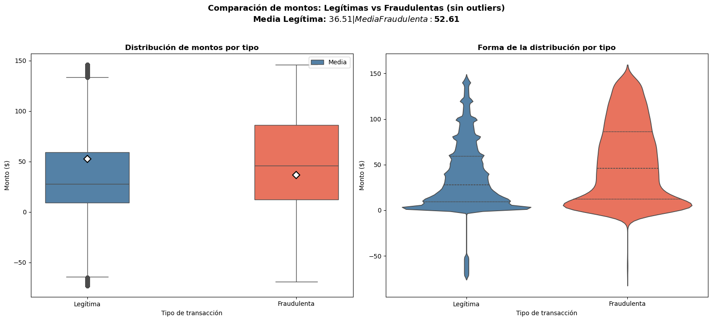
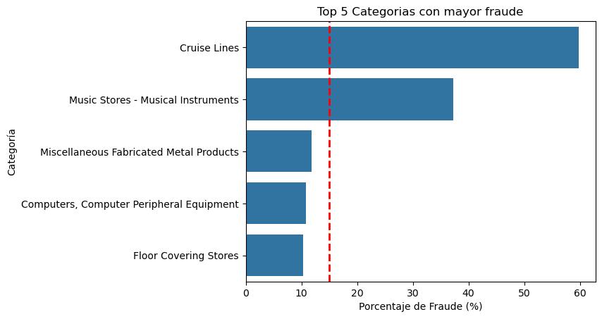
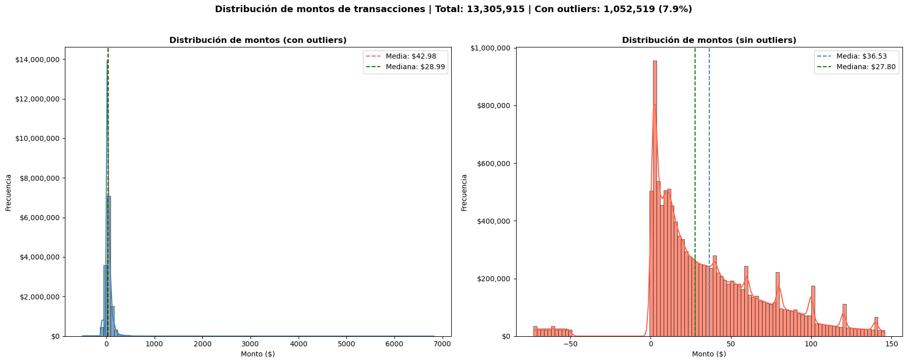

# REPORTE DE ANÁLISIS EXPLORATORIO
## Transacciones Financieras 2010-2019
### Dataset: [Kaggle](https://www.kaggle.com/datasets/computingvictor/transactions-fraud-datasets) 

| **Preparado por** | Raúl Viteri                             |
| ----------------- | --------------------------------------- |
| Área              | Financiera y Tributación                |
| Versión           | 1.0                                     |
| Clasificación     | Proyecto Personal - Análisis Financiero |

### 1. Resumen
---
Este reporte presenta los resultados del análisis exploratorio de datos (EDA) realizado sobre el dataset [transacciones financieras](https://www.kaggle.com/datasets/computingvictor/transactions-fraud-datasets) del período 2010-2019. El análisis abarca más de 13 millones de transacciones distribuidas en 108 categorías de comercio, con el objetivo de identificar patrones de gasto, comportamiento por segmento y señales de actividades fraudulentas.

| 13 M+                    | 108        | 0.15 %                    | 7.85%                  |
| :----------------------: | :--------: | :-----------------------: | :--------------------: |
| Transacciones analizadas | Categorias | Tasa de Fraude Confirmada | Transacciones atípicas |

*Hallazgo crítico: Las transacciones fraudulentas tienen un monto promedio mayor del 2.5x al de las transacciones legítimas ($110 vs $43), y se concentran desproporcionadamente en transacciones de monto atípico.*
### 2. Objetivo y Alcance
---
#### 2.1 Objetivo 
Realizar un análisis exploratorio de las transacciones financieras para identificar patrones de gasto, anomalías y señales de fraude relevantes para la toma de decisiones en el área de tributación y finanzas
#### 2.2 Fuente de Datos

| Archvio                  | Descripción               | Registros      |
| ------------------------ | :-----------------------: | -------------: |
| transactions_data.csv    | Transacciones principales | 13,305,915     |
| mcc_codes.json           | Códigos de categoría MCC  | 108 Categorias |
| train_fraude_labels.json | Etiquetas de fraude       | 8,914,963      |
| users_data.csv           | Datos demográficos        | 2,000          |
| card.csv                 | Datos de compra           | 6,146          |

#### 2.3 Período Analizado
Enero 2010 --- Octubre 2019 

### 3. Limpieza y Preparación de Datos
---
#### 3.1 Valores Nulos tratados

| Columna        | Nulos      | Tratamiento            | Justificación                                  |
| -------------- | :----------: | :---------------------: | ---------------------------------------------- |
| merchant_state | 1,563,700  | 'Online'/'Desconocido' | Transacciones online no tiene estado físico    |
| zip            | 1,652,706  | 'Online'/'Desconocido' | En las transacciones online no se necesita zip |
| errors         | 13,094,522 | 'Sin error'            | Nan indica transacciones sin error             |
| is_fraud       | 4,390,952  | -1 (sin clasificar)    | Dataset de etiquetas incompleto                |

#### 3.2 Transformaciones en las columnas
- Amount
	- Eliminado símbolo $ y convertido a float
- Date
	- Convertir a Datetime, extraer meses, años y dias 
- is_fraud
	- Convertir "Yes"/"No" a 1/0, y convertir a int
	- Merge al dataframe principal
- Merge con mcc_codes
	- Merge al dataframe principal
- Merge con user_data
	- Merge al dataframe principal
### 4. Análisis Exploratorio
---
#### 4.1 Estadísticas generales

| **Describe** | **Valores** | Interpretación |
| ------------ | :----------: | :-----------: |
| Promedio     | 42.98       | Inflado por outliers |
| Mediana      | 28.99       | Valor típico real de transacción |
| Máximo       | $6,820.20    | Transacción más frande registrada |
| Mínimo       | -$500       | Devolución más grande registrada |
| Total dataset | 13,305,915 | Transacciones en el periodo 2010 - 2019 |

#### 4.2 Tipos de transacción

| Tipo de Transacción | Cantidad de Transacción | Porcentaje |
| :-----------------: | :---------------------: | :--------: |
| Swipe Transaction   | 6,967,185               | 52.36%     |
| Chip Transaction    | 4,780,818               | 35.93%     |
| Online Transaction  | 1,557,912               | 11.71%     |

#### 4.3 Categoría con mayor y menor gasto
 Las 10 mejores categorías y Las 10 peores categorías

  

> [!IMPORTANT]
> Las 5 categorías principales concentran aproximadamente el 35% del gasto total. *Money transfer* y *Service Stations* lideran con más de $50M acumulados cada una.

#### 4.4 Evolución mensual del volumen de gasto

  

>El análisis del volumen mensual de transacciones para el período 2010-2019 revela una tendencia de crecimiento sostenido, con el monto mensual promedio aumentando de aproximadamente $4.2M en 2010 a $5.0M en 2019, representando un incremento del 19% en la década.
>Se identifica un patrón estacional claro y consistente a lo largo de todos los años analizados. El mes de mayor volumen acumulado es Julio con $49,696,315, seguido por Agosto ($49,510,320.78) y Octubre ($49,435,764.38), concentrando el tercer trimestre el pico más alto de actividad financiera del año.
>En contraste, Noviembre registra el menor volumen acumulado con $42,900,837.01, representando una caída del 13.7% respecto al mes de mayor actividad. Febrero es el segundo mes más bajo, comportamiento esperado dado su menor número de días. Las caídas periódicas observadas en la tendencia general corresponden precisamente a estos meses de menor actividad, confirmando la naturaleza estacional del dataset.
>Desde una perspectiva tributaria, el pico en el tercer trimestre podría reflejar mayor actividad comercial en temporada de vacaciones, mientras que la caída de noviembre — previo al período navideño — podría indicar un efecto de transición entre ciclos de consumo.

### 5. Análisis de Fraude
---
#### 5.1 Proporción de transacciones fraudulentas

| Tasa de Fraude General | Monto Promedio Fraude | Monto Promedio legítima | Diferencia de monto |
| :--------------------: | :--------------------: | :--------------------: | :--------------------: |
| 0.15%                  | $110                  | $43                     | 2.5x                |

  

#### 5.2 Comparación de Montos: Legítimas vs Fraude

  

> Las transacciones fraudulentas presentan mayor dispersión en sus montos, con una concentración en el rango medio-alto en comparación con las transacciones legítimas que se agrupan predominantemente en motos bajos.

#### 5.3 Categoría con mayor tasa de fraude

  

> [!IMPORTANT]
> Las categorías (Cruise Lines y Music Stores - Musical Instruments) que superan el promedio general de fraude (0.15%) requieren monitoreo prioritario en procesos de auditoría tributaria

#### 5.4 Análisis de outliers (Método IQR)

  

| Métricas                   | Valor                           |
| -------------------------- | :------------------------------ |
| Total outliers             | 1,044,249 (7.85%)               |
| Monto Mínimo               | - $500                          |
| Monto Máximo               | $6,820.20                       |
| Tasa de fraude en outliers | 0.54% (3.6 mas que el promedio) |

#### 5.5 Detección de patrones de Smurfing
Se aplicó un algoritmo de detección de transacciones múltiples en ventanas de tiempo cortas combinando tres criterios: volumen diario superior al percentil 99, monto promedio inferior al percentil 25, y desviación estándar de montos menor a $5.

| Criterio                   | Umbral p95 | Umbral p99 |
| -------------------------- | :--------: | :--------: |
| Transacciones diarias      | ≥ 8        | ≥ 11       |
| Monto Promedio             | ≤ $28.99   | ≤ $8.93    |
| Casos detectados           | 897,927    | 1,361      |
| Con repetición (std ≤ $5 ) | ---        | 2 casos    |
> Tras revisión manual, los 2 casos finales corresponden al cliente 1428 y presentan patrones de gasto cotidiano (alimentación y transporte urbano). Se descartan com smurfing real. 
> Se recomienda revisar el umbral de desviación estándar en futuras iteraciones.

### 6. Resumen de Hallazgos
---

| Hallazgo                                                                  | Métrica                         | Relevancia                                                                                           |
| ------------------------------------------------------------------------- | :-----------------------------: | ---------------------------------------------------------------------------------------------------- |
| La categoría *Money Transfer* lidera el gasto acumulado                   | $53.1M                          | Alta vigilancia                                                                                      |
| Tasa de fraude baja pero tiene una mayor concentración en los montos alto | 0.15%                           | El fraude impacta desproporcionadamente en valor, no en volumen                                      |
| Outliers tienen una tasa de fraude mayor                                  | 0.54% vs 0.15%                  | Transacciones de monto atípico deben activar revisión automática                                     |
| Transacciones sin etiqueta (33%)                                          | Mas de 4M de registros perdidos | Dataset incompleto, lo que lleva a que las conclusiones de fraude se deban interpretarse con cautela |
| No se detectaron patrones reales de smurfing                              | 2 falsos positivos              | Algoritmo requiere refinamiento con variables adicionales                                            |
| La categoría *Service Stations* concentra mayor volumen de outliers       | 177,463 outliers                | Inusual para categoría de gasto cotidiano - requiere un análisis adicional                           |
### 7. Recomendaciones
---
#### 7.1 Acciones inmediatas
- Obtener etiquetas de fraude para el 33% de transacciones sin clasificar para completar el análisis
- Establecer alertas automáticas para transacciones con montos superiores al límite IQR ($149.4)
- Revisar individualmente las transacciones en Money Transfer superiores a $5,000
#### 7.2 Mejoras al modelo de detección
- Incorporar variables de velocidad de transacción (múltiples en minutos, no solo en días)
- Agregar análisis de red (clientes conectados por merchant_id común)
- Refinar umbral de desviación estándar en detección de smurfing
#### 7.3 Próximo pasos
- Implementar modelo supervisado de clasificación de fraude (Random Forest / XGBoost)
- Cruzar datos con declaraciones tributarias de clientes con ratio gasto/ingreso > 1
- Análisis de estacionalidad avanzado por categoría para planificación fiscal
### 8. Conclusión
---
El análisis exploratorio de las [transacciones financieras](https://www.kaggle.com/datasets/computingvictor/transactions-fraud-datasets) 2010-2019 revela un dataset robusto con patrones claros de comportamiento de gasto. La tasa de **fraude confirmada** es baja (0.15%), sin embargo la concentración de fraude en transacciones de _mayor monto representa un riesgo financiero significativo_ que justifica la implementación de sistemas de monitoreo automatizado.

Las categorías de _Money Transfer_ y _Service Stations_ requieren atención prioritaria desde una perspectiva tributaria, tanto por su **volumen total** como por la **concentración de outliers**. Se recomienda continuar con un análisis supervisado una vez completadas las etiquetas de fraude faltantes.
